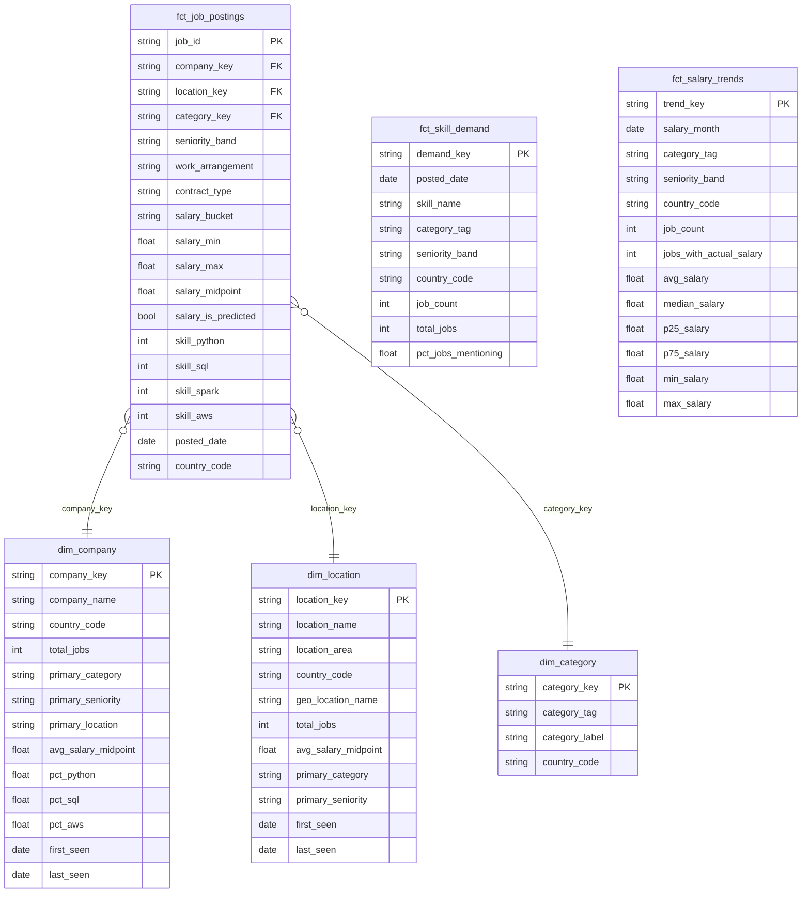

# Job Market Analytics

UK job market analytics pipeline built on Adzuna API data, Databricks Delta Lake, and dbt.

## Pipeline Overview

```
Adzuna API
    │
    ▼
Raw Zone (Delta Lake / object storage)
  endpoint=job_search/country=gb/ingestion_date=YYYY-MM-DD/data.json
  endpoint=categories/...
  endpoint=geodata/...
    │
    ▼
dbt – Staging        (views)       stg_jobs, stg_categories, stg_geodata, stg_salary_history
dbt – Intermediate   (tables)      int_jobs_enriched, int_location_enriched
dbt – Marts          (tables)      dim_*, fct_*
```

## Data Model



## Mart Tables

### Dimension Tables

| Table | Grain | Description |
|---|---|---|
| `dim_company` | company + country | Aggregated profile per employer: job volume, salary stats, top skills |
| `dim_location` | location + country | Geographic dimension enriched with Adzuna geodata |
| `dim_category` | category tag + country | Adzuna job category taxonomy |

### Fact Tables

| Table | Grain | Description |
|---|---|---|
| `fct_job_postings` | one row per job | Central fact table with FK references to all dims and 50+ skill flags |
| `fct_skill_demand` | date + skill + category + seniority | Daily skill mention counts and share of postings, for trend analysis |
| `fct_salary_trends` | month + category + seniority + country | Monthly salary aggregates (avg, median, quartiles) from actual postings only |

## Ingestion Schedules

| Schedule | Endpoints | Reason |
|---|---|---|
| Daily | `job_search` | Job postings change every day |
| Weekly | `categories`, `geodata` | Reference data — rarely changes; running daily would burn the 250 req/day free-tier budget |

## Setup

Copy `profiles.yml.example` to `~/.dbt/profiles.yml` and set the following environment variables (or add to `.env`):

```
DATABRICKS_HOST=
DATABRICKS_HTTP_PATH=
DATABRICKS_TOKEN=
ADZUNA_APP_ID=
ADZUNA_APP_KEY=
ADZUNA_RAW_ZONE_ROOT=/Volumes/job_market/raw/adzuna
```

Run ingestion:
```bash
uv run python scripts/ingestion/ingest_jobs.py daily
uv run python scripts/ingestion/ingest_jobs.py weekly
```

Run dbt:
```bash
dbt run
dbt test
```
