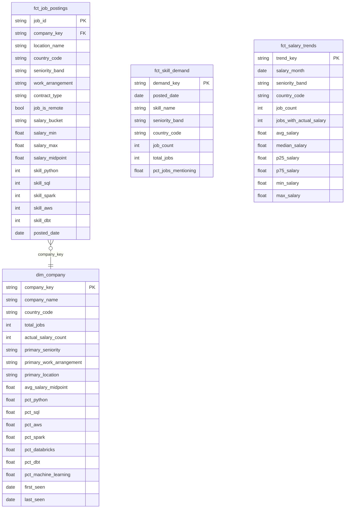

# Job Market Analytics

Job market analytics pipeline focused on Kenya / East Africa with global salary benchmarks, built on JSearch API data, Databricks Delta Lake, and dbt.

## Pipeline Overview

```
JSearch API (OpenWebNinja)
    │
    ▼
Raw Zone (Unity Catalog Volumes)
  endpoint=job_search/ingestion_date=YYYY-MM-DD/query={role+location}/data.jsonl
  endpoint=salary_estimate/ingestion_date=YYYY-MM-DD/query={role_location}/data.jsonl
    │
    ▼
dbt – Staging        (incremental)   stg_jobs, stg_salary_history
dbt – Intermediate   (incremental)   int_jobs_enriched
dbt – Marts          (tables)        dim_company, fct_job_postings, fct_skill_demand, fct_salary_trends
```

## Data Model



## Mart Tables

### Dimension Tables

| Table | Grain | Description |
|---|---|---|
| `dim_company` | company + country | Aggregated employer profile: job volume, salary stats, top skill percentages |

### Fact Tables

| Table | Grain | Description |
|---|---|---|
| `fct_job_postings` | one row per job | Central fact table with FK to `dim_company` and 50+ skill flags |
| `fct_skill_demand` | date + skill + seniority + country | Daily skill mention counts and share of postings, for trend charts |
| `fct_salary_trends` | month + seniority + country | Monthly salary aggregates (avg, median, quartiles) from job postings |

## Ingestion Schedules

| Schedule | Endpoint | Queries |
|---|---|---|
| Daily | `job_search` | 8 queries: data/software/ML engineer + analyst roles in Nairobi, remote Africa, UK, US |
| Weekly | `salary_estimate` | 6 benchmarks: key roles in Nairobi, London, New York |

JSearch free tier: **200 req/month**. 8 daily queries = ~240/month — trim or skip weekends to stay within budget.

## Setup

Copy `profiles.yml.example` to `~/.dbt/profiles.yml` and set the following in `.env`:

```
JSEARCH_API_KEY=
JSEARCH_RAW_ZONE_ROOT=/Volumes/job_market/raw/jsearch
DATABRICKS_HOST=
DATABRICKS_HTTP_PATH=
DATABRICKS_TOKEN=
```

Create the Unity Catalog Volume before first run:
```sql
CREATE SCHEMA IF NOT EXISTS job_market.raw;
CREATE VOLUME IF NOT EXISTS job_market.raw.jsearch;
```

Run ingestion:
```bash
uv run --env-file .env python scripts/ingestion/ingest_jobs.py daily
uv run --env-file .env python scripts/ingestion/ingest_jobs.py weekly
```

Run dbt:
```bash
dbt build
```
